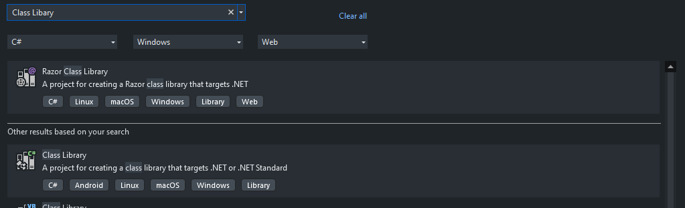

# Task-Tracker-CLI (Cmdlet)

Die genaue Aufgabenstellung findest du auf [Roadmap.sh](https://roadmap.sh/projects/task-tracker)

# Dokumentation

### Wichitge Command Lines
```Powershell
// Wie fügt man ein neues Cmdlet ein?
Import-Module .\bin\Debug\net8.0\Task-Tracker-CLI.ddl

// Wie sieht man die verfügbaren Commands meines Cmdlet?
Get-Command -module Task-Tracker-CLI

//Wie holt man sich genauere informatione über einen Command?
Get-Help  -full
```

### Was ist Cmdlet?
Cmdlets sind native Powershell-Befehle, keine eigenständig ausführbaren Dateien. Cmdlets werden in Powershell-Modulen gesammelt, die bei Bedarf geladen werden können. Cmdlets können in jeder kompilierten .NET-Sprache oder in der eigentlichen Powershell-Skriptsprache geschrieben werden.

Weitere Informationen findest unter:
- [Was ist ein PowerShell-Befehl? - Microsoft Learn](https://learn.microsoft.com/de-de/powershell/scripting/powershell-commands?view=powershell-7.4)
- [Cmdlet-Übersicht - Powershell - Microsoft Learn](https://learn.microsoft.com/de-de/powershell/scripting/developer/cmdlet/cmdlet-overview?view=powershell-7)

---

# Arbeits-Protokoll

## 19.11.2024

Start des Projekts. Ich habe eine ``Console-Anwendung`` mit Visual Studio erstellt. 
- Noch keine Änderungen oder Features hinzugefügt.


## 21.11.2024

Als ich mir heute die Aufgabe nochmal angeschaut habe. Ist mir aufgefallen das die Befehle im CLI ausgeführt werden und eine Console App nach der Ausführung beendet wird. Also habe ich mich schlau gemacht und herausgefunden das man ``Cmdlets`` bauen kann die man in der Powershell ausführen kann.

Hier sind meine Quellen, aus denen ich das herausgefunden habe:

- [Introduction Powershell](https://learn.microsoft.com/en-us/training/modules/introduction-to-powershell/)
- Wichitge Dokumentation = [Create a Class Libary Project](https://www.red-gate.com/simple-talk/development/dotnet-development/using-c-to-create-powershell-cmdlets-the-basics/)
- [How to write a cmdlet](https://learn.microsoft.com/en-us/powershell/scripting/developer/cmdlet/how-to-write-a-simple-cmdlet?view=powershell-7.4)
- [Cmdlet Attribute Declaration](https://learn.microsoft.com/en-us/powershell/scripting/developer/cmdlet/cmdlet-attribute-declaration?view=powershell-7.4)
- [Parameter Attribute Declaration](https://learn.microsoft.com/en-us/powershell/scripting/developer/cmdlet/parameter-attribute-declaration?view=powershell-7.4)

Also begann ich mein Projekt neu zu bauen. Zuerst habe ich meine Console-App gelöscht und eine Klassenbibliothek erstellt.



Dann musste ich im ``Nuget Manager`` eine [Powershell Assembly](https://www.nuget.org/packages/Microsoft.PowerShell.5.ReferenceAssemblies/1.1.0?_src=template) in meine Lösung einfügen.


Nachdem ich alles installiert hatte, konnte ich damit beginnen, meine Klasse ``Class1.cs`` umzubenennen. Für den Anfang habe ich den Namen so aufgebaut ``< Verb >< Noun >Cmdlet.cs`` ergo. ``GetTaskCmdlet.cs``

Um nun solche Cmdlets zu bauen, benötigt man die ``System.Management.Annotaions;``, daher musste ich auch die [Powershell Assembly](https://www.nuget.org/packages/Microsoft.PowerShell.5.ReferenceAssemblies/1.1.0?_src=template) im Nuget Manager herunterladen. 

```C#
using System.Management.Annotation;
```

**Beispielcode:** Ich habe ein Testbeispiel mit der Dokumentation von [Create a Class Libary Project](https://www.red-gate.com/simple-talk/development/dotnet-development/using-c-to-create-powershell-cmdlets-the-basics/) begonnen..


```C#
[Cmdlet(VerbsCommon.Get, "Task")]
[OutputType(typeof(Task))]
public class GetTaskTaskMakerCmdlet : Cmdlet
{
}
```

Später habe ich mit Hilfe der Anleitung die CLI-Befehlszeilen ausprobiert, um mein ``Cmdlet`` auszuführen. Hier sind die Befehle:

**Wie füge ich das Cmdlet in Powershell ein?**
```Powershell
Import-Module .\bin\Debug\net8.0\Task-Tracker-CLI.ddl
```

**Wie kann ich die verfügbaren Befehle meines Cmdlets anzeigen?**
```powershell
Get-Command -module Task-Tracker-CLI
```

**Wie erhalte ich genauere Informationen über eine Bestellung?**
```powershell
Get-Help  -full
```

Nachdem ich einige Änderungen vorgenommen habe, funktioniert der Import der ``DDL`` nicht mehr.


## 22.11.2024

Gestern und heute habe ich versucht, meinen Konsolenfehler zu beheben. Leider habe ich im Internet nichts gefunden oder es hat nicht geholfen. Ich habe dann noch ein [Nuget Package](https://www.nuget.org/packages/system.management.automation/) heruntergeladen in der Hoffnung, dass es damit funktioniert.

Meine Vermutung ist das es vielleicht an meiner Umgebung liegt:
- **Visual Studio** hat das falsche Framework für Powershell.
- **Powershell** muss auf dem neuesten Stand sein oder eine ältere Version haben.

## Restart Projekt

Ich habe mich entschieden das Projekt neu zu bauen, um zu sehen ob es noch funktioniert. Es kann gut sein, dass meine ``DLL`` einen Fehler hatte und ich sie in meiner Lösung nicht rekonstruieren konnte.
Folgende Dokumentation befolge ich um zu schauen ob die mir etwas bringt. [PowerShell Module als DLL in C# erstellen](https://www.nick-it.de/blog/powershell/powershell-module-als-dll-in-c-erstellen)

Als erstes habe ich festgestellt, dass ich die ganze Zeit die falsche Libary benutzt habe. Es gibt zwei verschiedene Libarys. Eine Libary hat eine .Net Referenz, während die andere eine ``DLL`` ist. 3 mal raten welche ich benutzt habe... Genau die mit .NET...


Dann nahm ich die DLL Libary und installierte meine Nuget Packages die ich brauchte und siehe da, es gab nicht einmal WARNINGS!!!!


Nachdem alles installiert war, habe ich einen kleinen Testcode aus der Dokumentation kopiert und modifiziert.

### Beispiel Code Task-Tracker.cs
```C#
using System;
using System.Collections.Generic;
using System.Management.Automation;

namespace Task_Tracker
{

    [Cmdlet(VerbsCommon.Get, "NITPerf")]
    [OutputType(typeof(Task))]
    public class TaskTracker : Cmdlet
    {

        private string myparameter;
        private string myparameter2;
        private string myparameter3;

        [Parameter]
        public string Myparameter { get => myparameter; set => myparameter = value; }

        [Parameter(ValueFromPipelineByPropertyName = true, ValueFromPipeline = true)]
        public string Myparameter2 { get => myparameter2; set => myparameter2 = value; }

        [Parameter]
        public string Myparameter3 { get => myparameter3; set => myparameter3 = value; }
        protected override void ProcessRecord()
        {

            Random ro = new Random();

            List<Task> returnList = new List<Task>();
            for (int i = 0; i < 10; i++)
            {
                var r1 = new Task();
                r1.Name = ro.Next().ToString();
                r1.Description = ro.Next().ToString();
                WriteObject(r1);
            }
        }
    }
}
```
### Beispiel Code Task.cs
```C#
namespace Task_Tracker
{
    public class Task
    {
        public int TaskID { get; set; }
        public string Name { get; set; }
        public string Description { get; set; }
    }
}

```

Dann führte ich meinen Befehl aus, um die generierte DLL einzufügen, und alles funktionierte. !!!! Ich war wie vom Donner gerührt, als ich nichts Rotes mehr sah.


